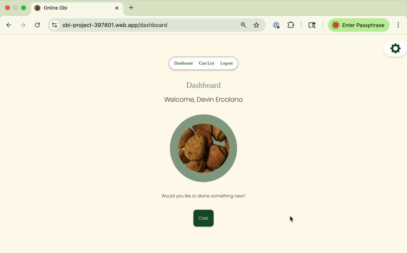

# Online Obi

## 🛠️ Built With  

<p align="center">
  
  
  
  
  
  
  
</p>

A modern React application that simulates a casting experience directly in the browser. Each randomized cast produces:

- A symbolic identifier and interpretation
- A yes/no/maybe outcome
- A set of four virtual tokens with smooth animations

Users can log in, save their casts, edit details, and revisit past results. Originally prototyped in Swift with Core Data, the project was reimagined in React, TailwindCSS, and Firebase to demonstrate responsive design, real-time data handling, and full-stack deployment.

🔗 **Live Demo**: [obi-project-397801.web.app](https://obi-project-397801.web.app)

## 🎯 Project Goals

I set out on this coding endeavor to learn how to use **ReactJS, Vite, Figma, OAuth, and TailwindCSS**.
   
---
## ✨ Features  

<p align="center">
  
  
  
  
  
</p>

## ⚙️ Prerequisites

Before you begin, ensure you have the following installed:

- [Node.js](https://nodejs.org/)  
- [npm](https://docs.npmjs.com/downloading-and-installing-node-js-and-npm)  
- [Firebase CLI](https://firebase.google.com/docs/cli) (`npm install -g firebase-tools`)  
- A Firebase project created in the [Firebase Console](https://console.firebase.google.com/)

## 📦 Dependencies

```json
"firebase": "^10.4.0",         
"framer-motion": "^10.16.4",     
"react": "^18.2.0",              
"tailwindcss": "^3.3.3",         
"typescript": "^5.0.2",         
"vite": "^4.4.5"             
```

## 🚀 Getting Started
### 1. Clone the repo
```bash
git clone https://github.com/quinise/OnlineObi.git
cd OnlineObi
```

### 2. Install dependencies
```bash
npm install
```

### 3. Firebase configuration

Create a `firebase.config.tsx` file in the root of your project and add your Firebase project keys from the Firebase Console.

Example:
```ts
// firebase.config.tsx
export const firebaseConfig = {
  apiKey: "YOUR_API_KEY",
  authDomain: "YOUR_AUTH_DOMAIN",
  projectId: "YOUR_PROJECT_ID",
  storageBucket: "YOUR_STORAGE_BUCKET",
  messagingSenderId: "YOUR_MESSAGING_SENDER_ID",
  appId: "YOUR_APP_ID"
};
```
### 4. Run locally
```bash
npm run dev
```

### 5. Navigate to http://localhost:5173

### 6. Build and deploy
```bash
npm run build
firebase deploy
```

---

## 🖼️ Screenshots & Demo

<p align="center">
  <br/>
  <em>Homepage – Generate Result button with animations</em>
</p>

<p align="center">
  <br/>
  <em>History – Saved casts with edit & delete options</em>
</p>

<p align="center">
  <br/>
  <em>Details – Expanded view of a single cast</em>
</p>

<p align="center">
  <br/>
  <em>Demo – Short animation of generating a cast</em>
</p>

## 🤝 Contributing
Contributions, issues, and feature requests are welcome!  

---
## 📄 License

This project is licensed under the MIT License.
